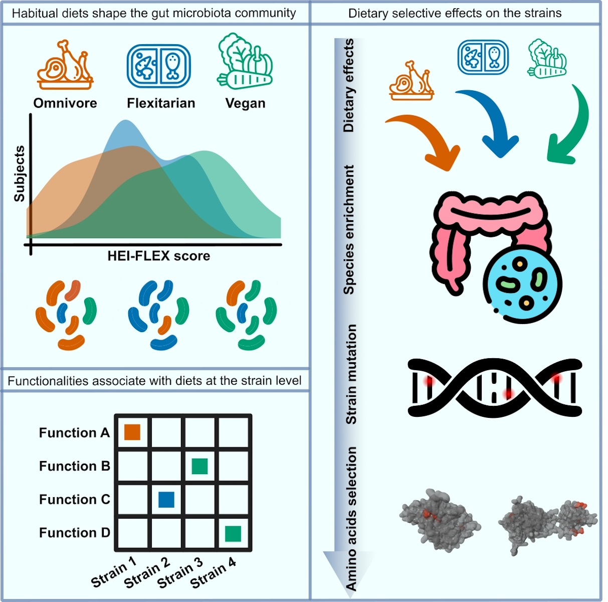

# KunDH-2024-CR_DietMetagenomics
Computational workflows for reproducing analysis in the study of Huang et al., 2024

#### Table of contents
1. [Setup](./docs/setup_general_usage.md)
2. [General usage](./docs/setup_general_usage.md)
3. Detailed tutorials
    * [Metagenomic reads preprocessing](https://github.com/KunDHuang/slurm-computing-family/blob/main/docs/preprocessing_reads.md)
    * [Microbial features filtering](./docs/microbial_features_filtering.md)
    * [Triangle correlation heatmap]()
    * [Metagenomic assembly and taxonomic assignment](https://github.com/KunDHuang/slurm-meta-assembly)
    * [Inferring strain-level diversity and selective pressure](https://github.com/KunDHuang/MEvol/blob/main/docs/gene_snv_analyzer.md)
4. Interactive graphs
    * [Taxonomic structure of 452 species in the cohort](https://hoshigawarei.github.io/HTML_TEST/)
    * [Taxonomic structure of 102 species linked with diet](https://hoshigawarei.github.io/graphlan_HTML/)
   
