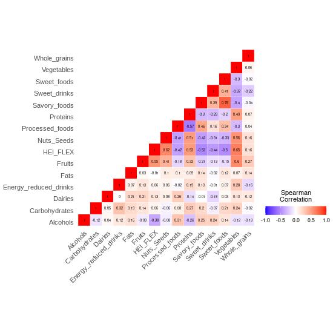

## First time setup

While no pre-installation is required for running workflows in this repository, you first need to download the repository to your local computer:
~~~bash
git clone git@github.com:KunDHuang/KunDH-2024-CR-DietMetagenomics.git
~~~ 

NOTE: As scripts provided in this repository depend on many third-party tools, we highly recommend [conda](https://conda.io/projects/conda/en/latest/index.html) environment for managing required dependencies which are listed in each of sections in the tutorials.

## General usages

This repository provides two types of utilities: 1) Python scripts and 2) Importable R functions

1) Python scripts are codes encapulated for executing specific analysis.
Example: [filtering microbial features based on abundances and prevalence.](../docs/microbial_features_filtering.md)
~~~bash
$ profile_cleaner.py --profile <microbial_species_prefiltering.tsv> --min_abundance 0.01 --min_prevalence 10 --output <microbial_species_postfiltering.tsv>
~~~  

2) Importable R functions are R codes wrapped up for solving specific problems and should be reusable by just importing their scripts. 

Example: [making triangle correlation plots.](../docs/)

~~~R
>source(file = "path_to_the_package/KunDH-2024-CR-DietMetagenomics/scripts/utils/triangle_heatmap_func.R")
>source(file = "path_to_the_package/KunDH-2024-CR-DietMetagenomics/scripts/utils/helper_func.R")

>(heatmap_plot <- plot_correlation_heatmap(cor_matrix_diet,
                                          grad_colors = c(low = "blue", high = "red", mid = "white"),
                                          x_text_size = 11,
                                          y_text_size = 11,
                                          insquare_text_size = 2))
~~~

