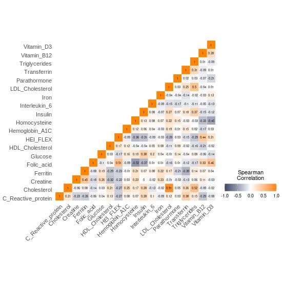

# Making triangle correlation heatmap
This tutorial is to use R-based functions to estimate correlation coefficients and visualize them in a triangle correlation heatmap

#### R packages required
* [ppcor](https://rdrr.io/cran/ppcor/man/pcor.html)
* [tibble](https://tibble.tidyverse.org/)
* [reshape2](https://cran.r-project.org/web/packages/reshape2/index.html)
* [ggplot2](https://ggplot2.tidyverse.org/)

#### Estimating correlation coefficients and triangle heatmap visualization

In this section, we will introduce function `make_est_df()` to calculate correlation coefficients between variables and function `plot_correlation_heatmap()` to visualize cofficients in a triangle heatmap, using two example datasets: [diet consumptions](../example_data/diet_consumption.csv) and [plasma measures](../example_data/cohort_metadata.tsv).

First, load relevant functions:

```{r}
>source(path_to_the_package/KunDH-2024-CR-DietMetagenomics/scripts/utils/helper_func.R)
>source(path_to_the_package/KunDH-2024-CR-DietMetagenomics/scripts/utils/triangle_heatmap_func.R)
```

Load [diet consumptions](../example_data/diet_consumption.csv) and [plasma measures](../example_data/cohort_metadata.tsv) data into two separate dataframes.

```{r}
diet_consumption_df <- read.csv("path_to_package/KunDH-2024-CR-DietMetagenomics/example_data/diet_consumption.csv",
                  sep = "\t",
                  header = T)
plasma_df <- read.csv("path_to_package/KunDH-2024-CR-DietMetagenomics/example_data/cohort_metadata.tsv",
                  sep = "\t",
                  header = TRUE)
```

If there are categorical values in character in any of columns of the dataframe, these values need to be converted into the numeric form first for correlation analysis. For example, in the column *Sex*, *Male* and *Female* need to be converted into 1 and 2. Here, we provided helper function `convert_all_strings_to_numbers(df)` to ease the convertion.

```{r}
diet_consumption_df <- convert_all_strings_to_numbers(diet_consumption_df)
plasma_df <- convert_all_strings_to_numbers(plasma_df)
```

Now we are ready to calculate correlation coefficients using function `make_est_df(df, parameters, control_vars = NULL)`:
  * `df`: The input dataframe.
  * `parameters`: A vector of parameters (column headers) in the df to estimate the correlation efficients.
  * `control_vars`: If needed, a vector of confounding variables to control. Partial spearman correlation will be used automatically in this case. 

```{r}
plasma_variables <- colnames(plasma_df)[2:20]
confounding_variables <- colnames(plasma_df)[21:25]

plasma_coefficients <- make_est_df(plasma_df, plasma_variables, confounding_variables)

diet_categories <- colnames(diet_consumption_df)[2:16]
diet_coefficients <- make_est_df(diet_consumption, diet_categories)
```


Once correlation coefficients are generated, we will use function `plot_correlation_heatmap` to plot a triangle heatmap with arguments:
  * `cor_matrix`: The coefficient matrix generated from function `make_est_df`.
  * `grad_colors`: Define the color gradient for the heatmap in the form of vector. default: [c(low = "#3C486B", high = "#FF8400", "mid" = "#FFFFFF")]
  * `x_text_angle`: Set the rotation angle for text along x-axis. default: [45]
  * `y_text_angle`: Set the rotation angle for text along y-axis. default [0]
  * `x_text_size`: Set the font size for text along x-axis. default: [11]
  * `y_text_size`: Set the font size for text along y-axis. default: [11]
  * `x_vjust`: Vectical justification for text along x-axis. default: [1]
  * `y_vjust`: Vectical justification for text along y-axis. default: [1]
  * `x_hjust`: Horizontal justification for text along x-axis. default: [1]
  * `y_hjust`: Horizontal justification for text along y-axis. default: [1]
  * `font_style`: Set the font style. default: ["Arial"]
  * `insquare_text_size`: Set the text size inside heatmap squares. default: [2]
  * `insquare_text_color`: Set the text color inside heatmap squares. ["black"]

```{R}
(plasma_heatmap_plot <- plot_correlation_heatmap(plasma_coefficients,
                                                 x_text_size = 11,
                                                 y_text_size = 11,
                                                 insquare_text_size = 2))


(diet_heatmap_plot <- plot_correlation_heatmap(diet_coefficients,
                                               grad_colors = c(low = "blue", high = "red", mid = "white"),
                                               x_text_size = 11,
                                               y_text_size = 11,
                                               insquare_text_size = 2))
```
Example outputs:


